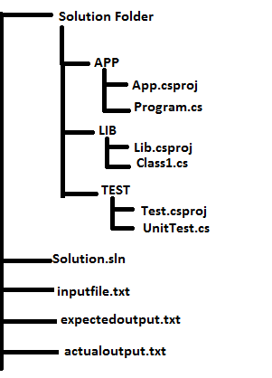

## CP Automation

### Features 

* Multiple competitive Programming sites support.
* Automatically loads the Sample input and expected output from sites.
* It automatically compares the output of the Program and Expected Output.
* Multiple programming language supports.
* Multi platform-support
* In the end, shows how much time to finish the program.

 
### ToDo

1. Collect the parameters that we need from the user.
2. Create dependencies for multiple languages.
3. Get the input and expected output from the sites.
4. Put in input and expected output from separate text files.
5. stores program output in a separate text file.
6. compare expected output and actual output
7. The actual output is wrong to show an error with a warning.
8. both outputs are correct shows how much time for working with the problem 

### Project Folder Structure
 ex: C#

 

    